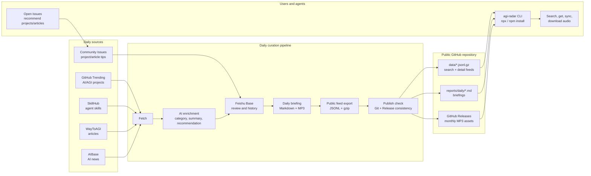

<p align="center">
  
</p>

<p align="center">
  <a href="https://github.com/szsip239/Daily-AGI-Radar/blob/main/README.zh-CN.md">中文 README</a>
</p>

# Daily AGI Radar

Daily AGI Radar is a public AI signal library for people and agents who want to keep up with useful AI projects, agent skills, articles, news, daily briefings, and audio summaries.

The goal is simple: make it easier for everyone to discover current GitHub projects and practical skills, learn how AI tools are evolving, and improve their own AI workflows through a shared, searchable knowledge feed.

The `agi-radar` CLI reads public feeds over HTTPS. It supports status checks, local sync, search, detail lookup, audio download, and URL-only submissions.

## How It Works



## Current Public Dataset

As of the 2026-06-07 public manifest:

| Feed | Count | What It Contains |
| --- | ---: | --- |
| Search records | 4,776 | Compact records for fast CLI search across all public signals |
| GitHub projects | 395 | Trending AI/AGI repositories with stars, growth, category, summary, recommendation |
| Skills | 2,520 | SkillHub skills with install signals, category, capability summary, recommendation |
| Articles | 421 | Curated articles with source URL, author, date, category, summary, recommendation score |
| News | 1,299 | AI news items with source URL, date, category, and curated summary |
| Daily briefings | 76 | Markdown daily reports in `reports/daily/` |
| Audio briefings | 65 | MP3 metadata pointing to monthly GitHub Release assets |

The live counts are available from the public manifest and from a full sync:

```bash
npx agi-radar@latest sync --all --json
```

## Daily Update Cycle

The public repository is updated by a daily local pipeline:

1. Fetch GitHub Trending projects, SkillHub skills, WayToAGI articles, and AIBase news.
2. Add AI-enriched fields such as category, summary, recommendation, and ranking signals.
3. Write reviewed records into Feishu Base for deduplication and historical tracking.
4. Generate the daily Markdown briefing and MP3 audio briefing.
5. Export public JSONL feeds and compressed `.gz` files.
6. Commit `data/` and `reports/` to GitHub, upload MP3 files to monthly GitHub Releases, then verify local and remote data match.

## Record Fields

The search feed is intentionally compact so agents can search quickly:

```text
handle, type, title, url, summary, source, signal_date,
category, rank_signals, detail_feed, detail_key
```

Detail feeds keep the full public record:

| Type | Stable Handle | Important Fields |
| --- | --- | --- |
| GitHub project | `github:owner/repo` | project URL, author, category, stars, star growth, trend type, README summary, recommendation |
| Skill | `skill:slug` | skill URL, category, capability summary, installs, install growth, stars, recommendation |
| Article | `article:date-id` | source URL, author, article date, category, curated summary, recommendation score |
| News | `news:date-id` | source URL, date, category, curated summary, source |
| Briefing | `briefing:YYYY-MM-DD` | daily Markdown URL, local report path, summary |
| Audio | `audio:YYYY-MM-DD` | MP3 Release URL, file name, release tag, file size |

Every detail record also includes a `fields` object containing the original public field names used by the curation pipeline.

## How People Use It

Use it without installing anything permanently:

```bash
npx agi-radar@latest search "agent memory" --json
npx agi-radar@latest get github:owner/repo --json
npx agi-radar@latest get audio:latest --download ./daily.mp3
```

Or install once:

```bash
npm install -g agi-radar
agi-radar sync --json
agi-radar search "Claude Code skills" --limit 10 --json
agi-radar get briefing:latest --json
```

Use `--json` when calling from a harness agent, script, or workflow. Leave it off for a more human-readable terminal output.

## How To Co-Create

Daily AGI Radar is meant to become a shared learning resource. Public submissions are review candidates, not direct feed writes.

You can help by opening an issue to recommend:

- GitHub projects worth tracking
- articles worth reading and summarizing

The CLI can also create review issues for supported URL types:

```bash
agi-radar submit github https://github.com/owner/repo
agi-radar submit skill https://skillhub.cn/skills/example
```

Submissions are reviewed before they enter public feeds. Please include the URL and a short reason why it is useful for AI builders or learners.

## Command Reference

Use directly with `npx`:

```bash
npx agi-radar@latest status --json
npx agi-radar@latest search "agent memory" --json
```

Or install globally:

```bash
npm install -g agi-radar
agi-radar status --json
```

During local development:

```bash
npm install
npm test
node dist/cli.js status --json
```

```bash
agi-radar status --json
agi-radar config list --json
agi-radar sync --json
agi-radar search "agent memory" --json
agi-radar get github:owner/repo --json
agi-radar get audio:latest --download ./daily.mp3
agi-radar submit github https://github.com/owner/repo
agi-radar submit skill https://skillhub.cn/skills/example
```

Useful examples:

```bash
agi-radar search "Claude Code skills" --limit 10 --json
agi-radar search "agent workflow automation" --no-cache --json
agi-radar get github:owner/repo --json
agi-radar get briefing:latest --json
agi-radar get audio:latest --download ./daily-agi-radar.mp3
```

## Public Data

The CLI starts from:

```text
https://raw.githubusercontent.com/szsip239/Daily-AGI-Radar/main/data/manifest.json
```

MP3 files are not committed to Git. Audio assets should be published through GitHub Releases, with metadata recorded in the public audio feed.

The default manifest includes:

- Search feed: `data/search.jsonl.gz`
- Detail feeds: `data/details/*.jsonl.gz`
- Daily briefings: `reports/daily/YYYY-MM-DD.md`
- Audio metadata: `data/audio.jsonl.gz`
- MP3 assets: monthly GitHub Releases such as `audio-2026-06`

## Development

```bash
npm install
npm test
npm run build
```

The CLI implementation contract is in [docs/cli-spec.md](docs/cli-spec.md).
