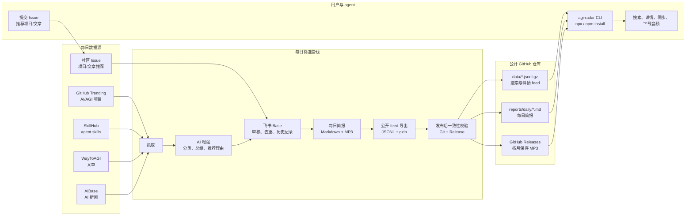

<p align="center">
  
</p>

<p align="center">
  <a href="https://github.com/szsip239/Daily-AGI-Radar/blob/main/README.md">English README</a>
</p>

# Daily AGI Radar

Daily AGI Radar 是一个公开的 AI 信号库，面向希望持续了解 AI 项目、agent skills、文章、新闻、每日简报和音频日报的人与 agent 工具。

它的目标是把每日 AI 信息流沉淀成可搜索、可拉取、可复用的公开资料，让大家更方便地了解当前流程中的 GitHub 项目和 skills，学习新的 AI 使用方法，并通过社区投稿一起共创。

`agi-radar` CLI 会通过 HTTPS 读取公开 feed，支持状态检查、本地同步、搜索、详情查询、音频下载和 URL 投稿。

## 它怎么运作



## 当前已经有什么数据

截至 2026-06-07 的公开 manifest：

| Feed | 数量 | 内容 |
| --- | ---: | --- |
| 搜索记录 | 4,776 | 用于 CLI 快速搜索的紧凑记录，覆盖所有公开信号 |
| GitHub 项目 | 395 | AI/AGI 趋势仓库，含 stars、增长、分类、总结、推荐理由 |
| Skills | 2,520 | SkillHub skills，含安装量、分类、能力总结、推荐理由 |
| 文章 | 421 | 精选文章，含原文链接、作者、日期、分类、摘要、推荐分 |
| 新闻 | 1,299 | AI 新闻，含来源链接、日期、分类、内容整理 |
| 每日简报 | 76 | `reports/daily/` 下的 Markdown 日报 |
| 音频日报 | 65 | MP3 元数据，文件保存在按月划分的 GitHub Releases |

实时数量可以从公开 manifest 或完整同步结果里看到：

```bash
npx agi-radar@latest sync --all --json
```

## 每日怎么更新

公开仓库由本地日报管线每天更新一次：

1. 抓取 GitHub Trending 项目、SkillHub skills、WayToAGI 文章和 AIBase 新闻。
2. 补充 AI 增强字段，例如分类、摘要、推荐理由和质量/排名信号。
3. 写入飞书 Base，用于去重、审核和历史追踪。
4. 生成每日 Markdown 简报和 MP3 音频简报。
5. 导出公开 JSONL feed 和压缩 `.gz` 文件。
6. 提交 `data/`、`reports/` 到 GitHub，把 MP3 上传到按月份划分的 GitHub Releases，并校验本地与远端一致。

## 数据字段长什么样

搜索 feed 只保留紧凑字段，方便 agent 快速检索：

```text
handle, type, title, url, summary, source, signal_date,
category, rank_signals, detail_feed, detail_key
```

详情 feed 会保留完整公开记录：

| 类型 | 稳定 handle | 关键字段 |
| --- | --- | --- |
| GitHub 项目 | `github:owner/repo` | 项目链接、作者、分类、stars、stars 增长、趋势类型、README 总结、推荐理由 |
| Skill | `skill:slug` | skill 链接、分类、能力总结、安装量、安装增长、stars、推荐理由 |
| 文章 | `article:date-id` | 原文链接、作者、文章日期、分类、摘要、推荐程度 |
| 新闻 | `news:date-id` | 来源链接、日期、分类、内容整理、来源 |
| 简报 | `briefing:YYYY-MM-DD` | 日报 Markdown URL、本地路径、摘要 |
| 音频 | `audio:YYYY-MM-DD` | MP3 Release URL、文件名、release tag、文件大小 |

每条详情记录还包含 `fields` 对象，保留筛选管线里的原始公开字段名，方便用户或自己的 LLM 做二次整理。

## 用户怎么获取

不需要 clone 仓库，也不需要安装：

```bash
npx agi-radar@latest search "agent memory" --json
npx agi-radar@latest get github:owner/repo --json
npx agi-radar@latest get audio:latest --download ./daily.mp3
```

也可以全局安装：

```bash
npm install -g agi-radar
agi-radar sync --json
agi-radar search "Claude Code skills" --limit 10 --json
agi-radar get briefing:latest --json
```

给 harness agent、脚本或自动化流程用时，建议加 `--json`。人直接在终端看，可以不加。

## 怎么共创反馈

Daily AGI Radar 希望成为一个共享学习资料库。公开投稿会作为候选内容进入审核流程，不会直接写入公开 feed。

欢迎通过 Issue 推荐：

- 值得跟踪的 GitHub 项目
- 值得阅读和总结的文章

CLI 目前也支持为部分 URL 类型创建审核 Issue：

```bash
agi-radar submit github https://github.com/owner/repo
agi-radar submit skill https://skillhub.cn/skills/example
```

提交时请附上 URL，并简单说明它为什么对 AI 构建者或学习者有价值。

## 命令速查

直接用 `npx`：

```bash
npx agi-radar@latest status --json
npx agi-radar@latest search "agent memory" --json
```

或全局安装：

```bash
npm install -g agi-radar
agi-radar status --json
```

本地开发：

```bash
npm install
npm test
node dist/cli.js status --json
```

```bash
agi-radar status --json
agi-radar config list --json
agi-radar sync --json
agi-radar search "agent memory" --json
agi-radar get github:owner/repo --json
agi-radar get audio:latest --download ./daily.mp3
agi-radar submit github https://github.com/owner/repo
agi-radar submit skill https://skillhub.cn/skills/example
```

更多例子：

```bash
agi-radar search "Claude Code skills" --limit 10 --json
agi-radar search "agent workflow automation" --no-cache --json
agi-radar get github:owner/repo --json
agi-radar get briefing:latest --json
agi-radar get audio:latest --download ./daily-agi-radar.mp3
```

## 公开数据

CLI 默认从这里读取 manifest：

```text
https://raw.githubusercontent.com/szsip239/Daily-AGI-Radar/main/data/manifest.json
```

默认公开数据包括：

- 搜索 feed：`data/search.jsonl.gz`
- 详情 feed：`data/details/*.jsonl.gz`
- 每日简报：`reports/daily/YYYY-MM-DD.md`
- 音频元数据：`data/audio.jsonl.gz`
- MP3 文件：按月份发布到 GitHub Releases，例如 `audio-2026-06`

MP3 不直接提交到 Git 仓库，避免仓库体积持续膨胀。

## 开发

```bash
npm install
npm test
npm run build
```

CLI 实现约定见 [docs/cli-spec.md](docs/cli-spec.md)。
